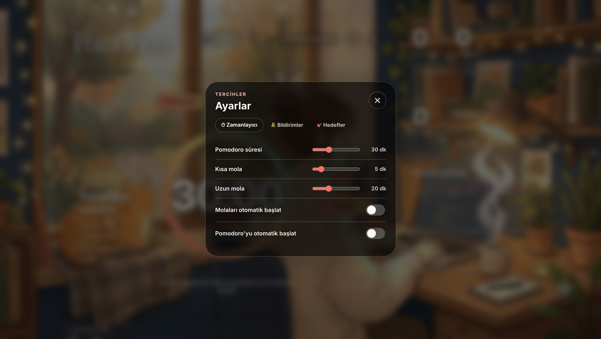
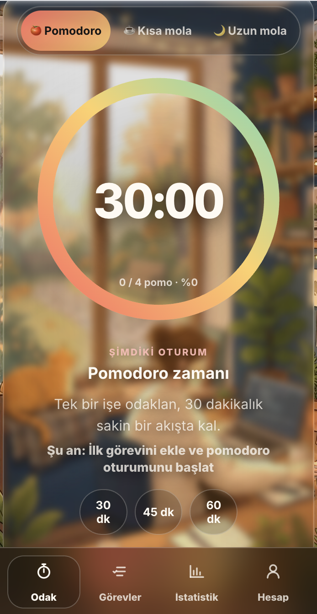
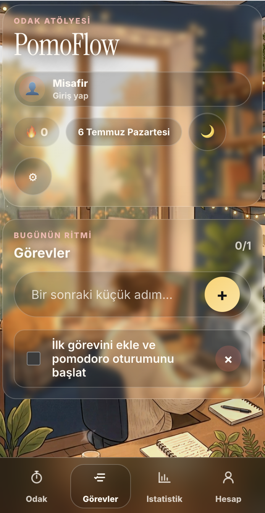
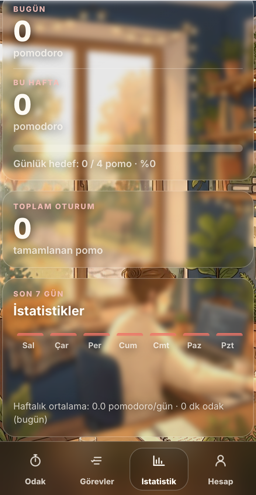
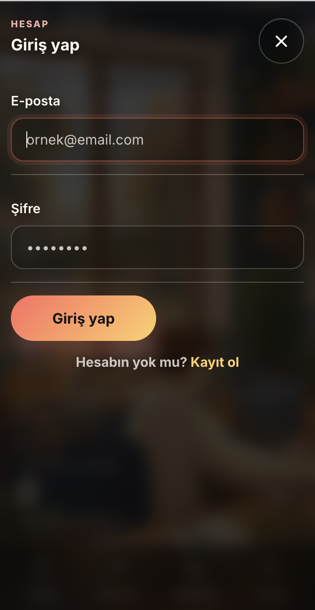

# PomoFlow

PomoFlow, Pomodoro tekniğini temel alan, odak oturumlarını, görev yönetimini ve kişisel verimliliği tek bir uygulamada birleştiren modern bir üretkenlik uygulamasıdır.

Uygulama Vanilla JavaScript ile geliştirilmiş olup, Progressive Web App (PWA) desteği sayesinde masaüstü ve mobil cihazlarda uygulama deneyimi sunar. Ayrıca Supabase entegrasyonu ile kullanıcı hesabı oluşturabilir ve verilerinizi cihazlar arasında senkronize edebilirsiniz.

## Demo

> Canlı demo yakında eklenecektir.

## Özellikler

- Pomodoro, kısa mola ve uzun mola zamanlayıcısı
- Özelleştirilebilir oturum süreleri
- Görev ekleme, tamamlama ve silme
- Timer altında aktif görev gösterimi
- Günlük hedef ve ilerleme yüzdesi
- Günlük, haftalık ve toplam istatistikler
- Streak sistemi
- Spotify embed desteği
- Dark / light tema
- Tarayıcı bildirimi, ses ve desteklenen cihazlarda titreşim
- Guest/local mod ve kullanıcı bazlı Supabase senkronizasyonu
- Mobil bottom navigation
- Desktop ve mobil için ayrı video arka plan desteği

## Kullanılan Teknolojiler

- HTML5
- CSS3
- Vanilla JavaScript
- Supabase Auth ve Database
- LocalStorage
- Service Worker
- Web App Manifest
- PWA

## PWA Özellikleri

- `manifest.json` ile install edilebilir uygulama deneyimi
- Offline app shell cache
- Desktop ve mobil video asset cache listesi
- `standalone` display modu
- 192x192 ve 512x512 ikonlar
- Maskable icon tanımı
- Mobil cihazlar için portrait odaklı deneyim

## Supabase Kurulumu

1. Supabase üzerinde yeni bir proje oluştur.
2. `supabase-setup.sql` dosyasındaki SQL'i Supabase SQL Editor içinde çalıştır.
3. `config.js` dosyasını kendi proje bilgilerinle doldur:

```js
window.POMOFLOW_CONFIG = {
  supabaseUrl: "https://your-project.supabase.co",
  supabaseAnonKey: "your-anon-key",
};
```

4. Uygulamada Hesap panelinden kayıt ol veya giriş yap.

Supabase yapılandırılmadığında uygulama guest/local modda çalışmaya devam eder.

## Local Çalıştırma

Projeyi HTTP server ile açmak PWA ve service worker testleri için gereklidir.

```bash
npm run start
```

Ardından tarayıcıda aç:

```txt
http://localhost:4173
```

Kontroller:

```bash
npm run check
npm run pwa:check
```

## Ekran Görüntüleri

### Desktop

Ana odak ekranı:


Odak, görev ve istatistik alanlarının geniş ekran görünümü:


Ayarlar modalı:



### Mobil

Mobil odak ekranı:



Mobil görevler:



Mobil istatistikler:



Mobil hesap ekranı:



## Test Planı

PWA ve mobil test adımları için:

```txt
PWA_TEST_PLAN.md
```

## Gelecek Geliştirmeler

- Capacitor ile Android build
- Telefonda 2-3 günlük gerçek kullanım testi
- Play Store Internal Testing hazırlığı
- Daha gelişmiş Supabase profil ekranı
- Üretim ortamı için gizlilik politikası ve store listing içeriği

## Lisans

MIT
